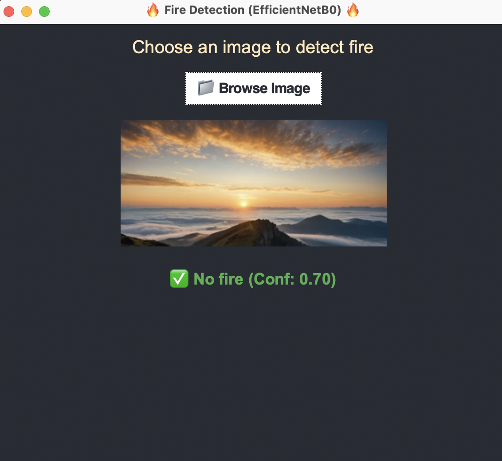
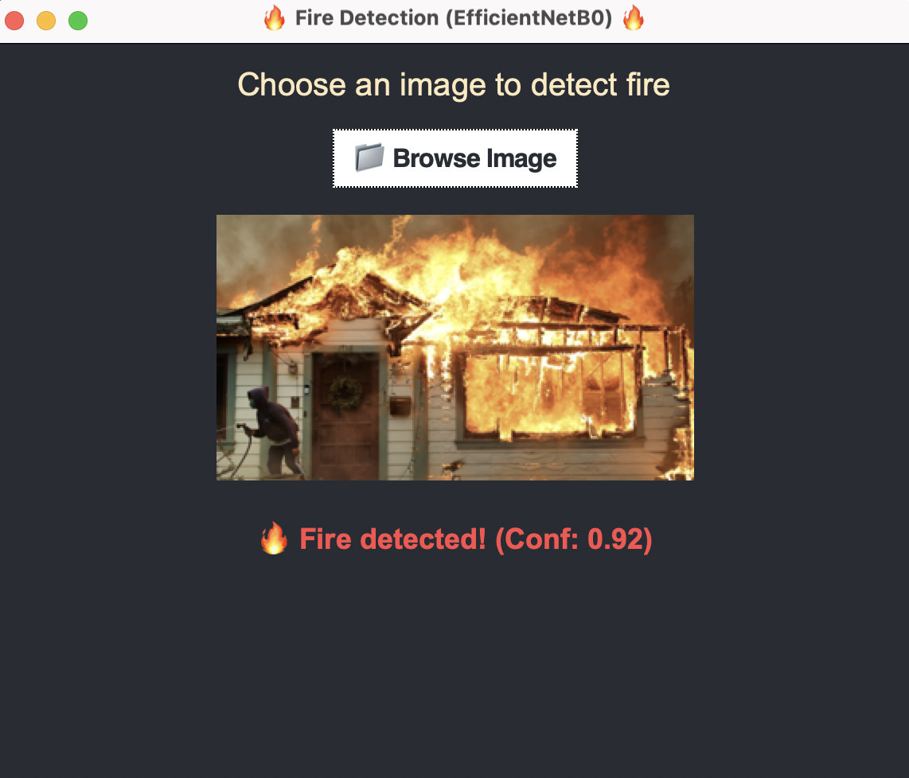
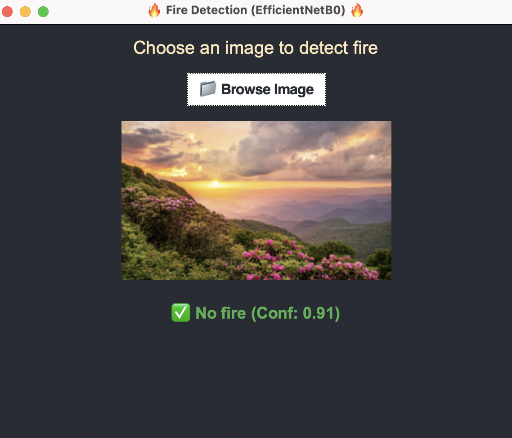
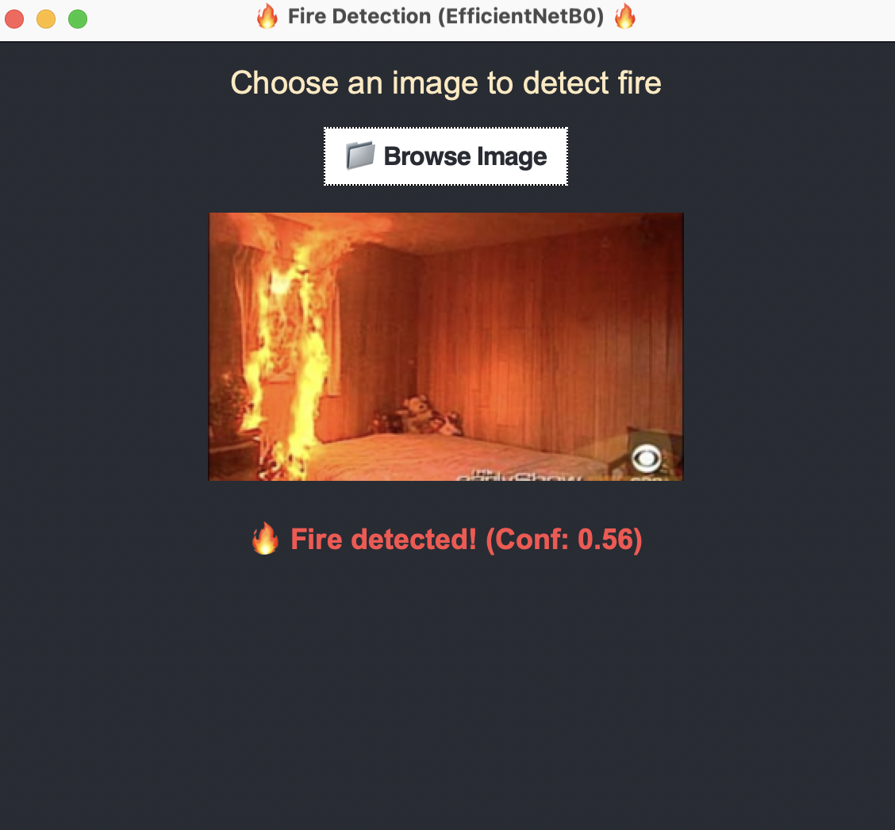
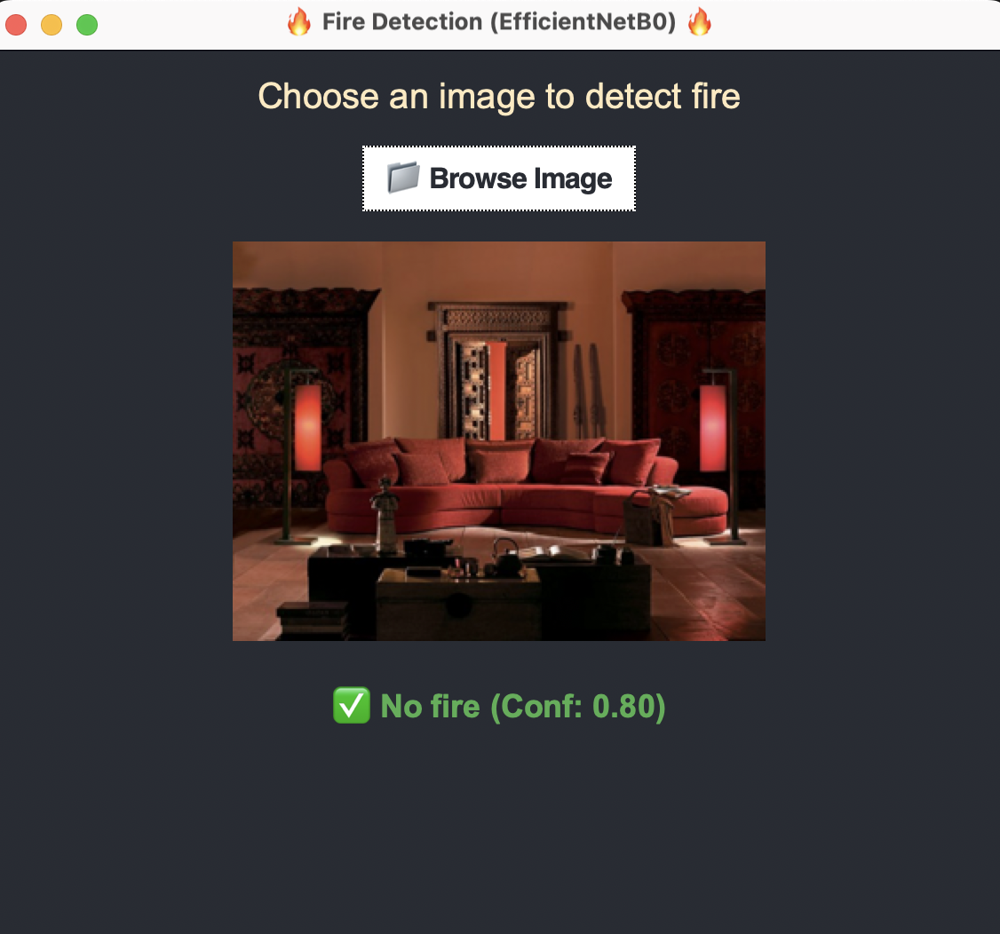

# Fire Detection Using Deep Learning (EfficientNetB0, ResNet50, VGG16)

This project applies deep learning and image processing techniques to detect fire in images. I trained and evaluated three convolutional neural network (CNN) architectures — **EfficientNetB0**, **ResNet50**, and **VGG16** — to determine which model achieves the best performance in identifying fire-related scenes.

## 🚀 Project Highlights

-  Image preprocessing using HSV color masking and filtering
-  Modular preprocessing pipeline (`image_processing.py`, `new_preprocessing.py`)
-  Model training with three architectures:
  - `EfficientNetB0` (best performance)
  - `ResNet50`
  - `VGG16`
-  Evaluation and testing scripts for each model
-  Model weights saved for reuse

---

## 🗂️ Project Structure
```

FIREDETECTION/
│
├── image_processing.py # Original image preprocessing functions
├── new_preprocessing.py # Alternate image preprocessing pipeline
├── test_image_processing.py # Testing preprocessing functions
├── test_new_preprocessing.py
│
├── trainingEfficientNetB0.py # Train EfficientNetB0
├── trainingResNet50.py # Train ResNet50
├── trainingVGG16.py # Train VGG16
│
├── testingEfficientNetB0.py # Test EfficientNetB0 (best performance)
├── testingResNet50.py
├── testingVGG.py
│
├── fire_detection_model.h5 # Saved model
└──  fire_detection_*.keras/.h5 # Various saved models/weights
```
---

## 🧪 How to Run

Train the model:
```bash
python trainingEfficientNetB0.py
```
Test the model:
```bash
python testingEfficientNetB0.py
```
---

## 📦 Dependencies

Required libraries include:
- tensorflow
- numpy
- opencv-python
- matplotlib
  
---

## 📈 Results
EfficientNetB0 achieved the highest accuracy among all models.

- **Epochs:** 10  
- **Final Training Accuracy:** 93.4%  
- **Final Validation Accuracy:** **97.24%**  
- **Final Validation Loss:** 0.1365

### 🔍 Confusion Matrix

| 107        | 2 | 
|--------------|-----------|
| 4  | 104      | 

### 🧾 Classification Report

| Class        | Precision | Recall | F1-score | Support |
|--------------|-----------|--------|----------|---------|
| 0 (No Fire)  | 0.96      | 0.98   | 0.97     | 109     |
| 1 (Fire)     | 0.98      | 0.96   | 0.97     | 108     |
| **Accuracy** |           |        | **0.97** | **217** |

## 🖼️ Screenshots
  
  
  
  
  


### ✅ Summary

- The model demonstrates high reliability with **balanced precision and recall**.
- It can be confidently used for fire detection in real-time or post-processing scenarios.
  
  ---

## Credits
Developed by Laura as part of the **Advanced Artificial Intelligence Course Project**.
  
